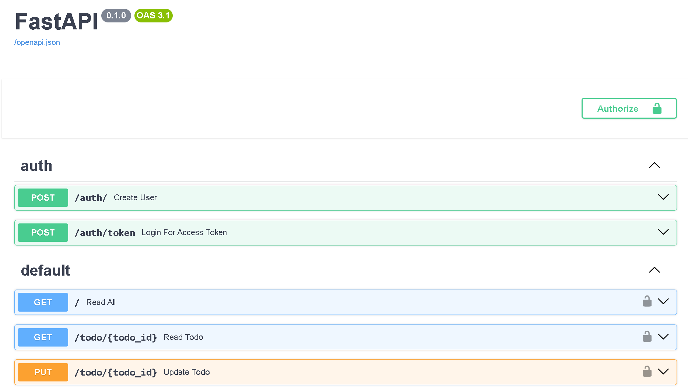
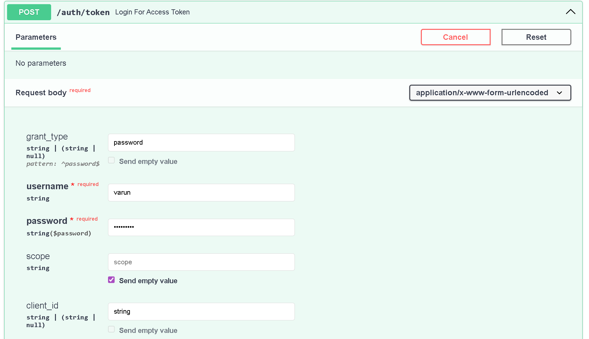
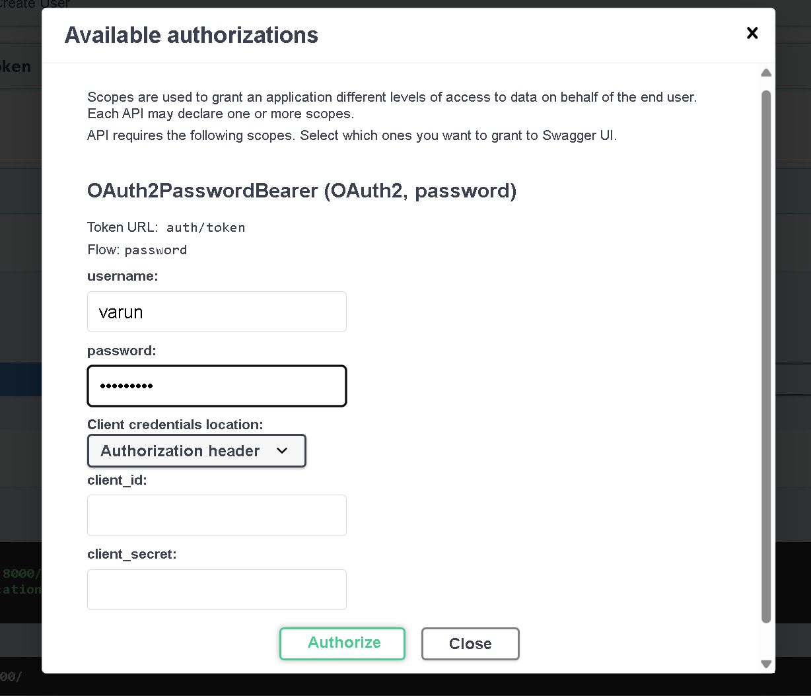
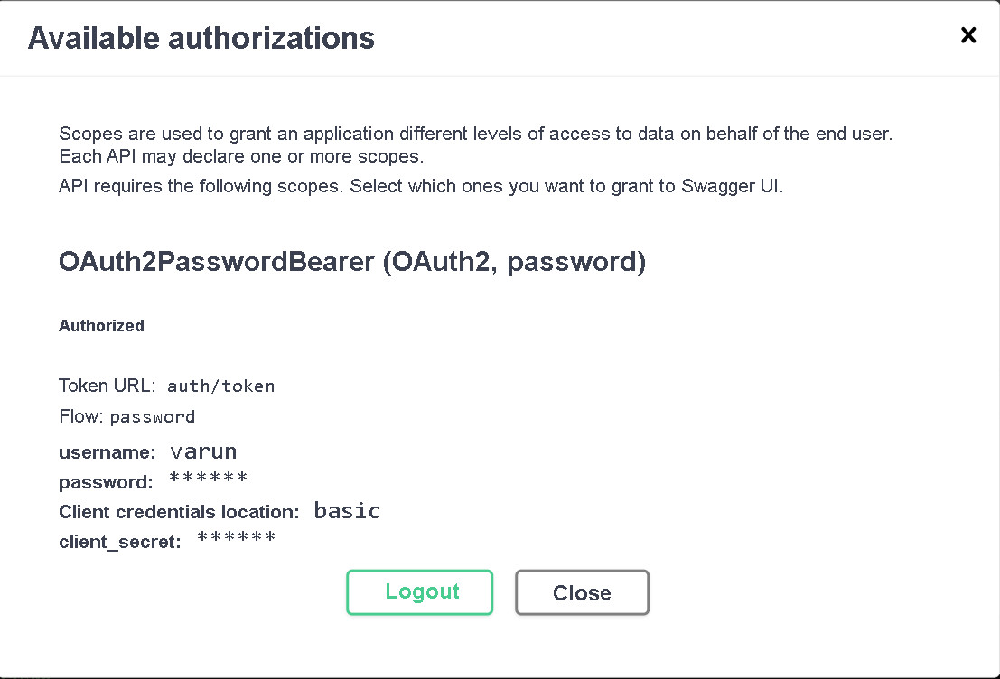
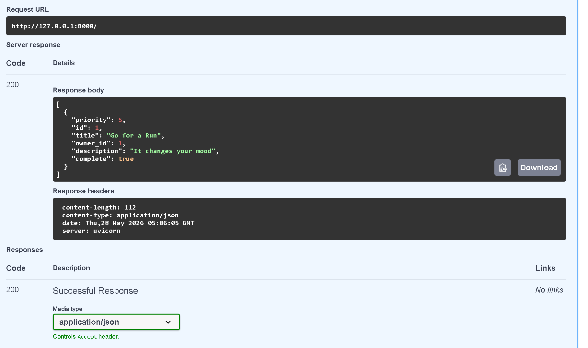

# FastAPI JWT Todo API

A FastAPI-based Todo REST API with JWT authentication, SQLAlchemy ORM, PostgreSQL/SQLite integration, and protected CRUD operations.

## Features

- User Registration and Login
- JWT Authentication
- Protected CRUD Operations
- Todo Ownership using Foreign Keys
- Database Migrations with Alembic
- Environment Variable Configuration

## Tech Stack

- FastAPI
- SQLAlchemy
- PostgreSQL / SQLite
- Alembic
- JWT Authentication
- Pydantic
- Python

## Project Structure

```text
TodoApp/
│
├── routers/
│   ├── auth.py
│   ├── todos.py
│   ├── users.py
│   └── admin.py
├── alembic/
├── main.py
├── models.py
├── database.py
├── requirements.txt
└── README.md
```

## Installation

Clone repository
```bash
git clone https://github.com/varunreddyk16/fastapi-jwt-todo-api.git
```

Install dependencies
```bash
pip install -r requirements.txt
```

Run server
```bash
uvicorn main:app --reload
```

## API Documentation

Swagger UI:

http://127.0.0.1:8000/docs


## Endpoints

```text
POST /auth/
POST /auth/token

GET /todos/
POST /todos/todo
PUT /todo/{id}
DELETE /todo/{id}
```

## Authentication Flow

1. User logs in
2. JWT token is generated
3. Token is sent with protected requests
4. User is authenticated
5. Protected endpoints become accessible

## Architecture Overview

- Authentication handled using JWT tokens
- Users and Todos stored using SQLAlchemy ORM models
- Todos are linked to users using Foreign Key relationships
- Protected endpoints verify users before allowing operations
- Database schema changes managed using Alembic migrations

## Environment Variables

Create a `.env` file and configure:

```env
SECRET_KEY=your_secret_key
ALGORITHM=HS256
DATABASE_URL=your_database_url
```

## Alembic Migration Commands
Run migrations:

```bash
alembic upgrade head
```

## Screenshots

### Swagger Documentation


### Login Endpoint


### JWT Authentication


### Authorisation


### Todo CRUD Operations



## Future Improvements

- Frontend Integration
- Deployment
- Testing
- Docker Support